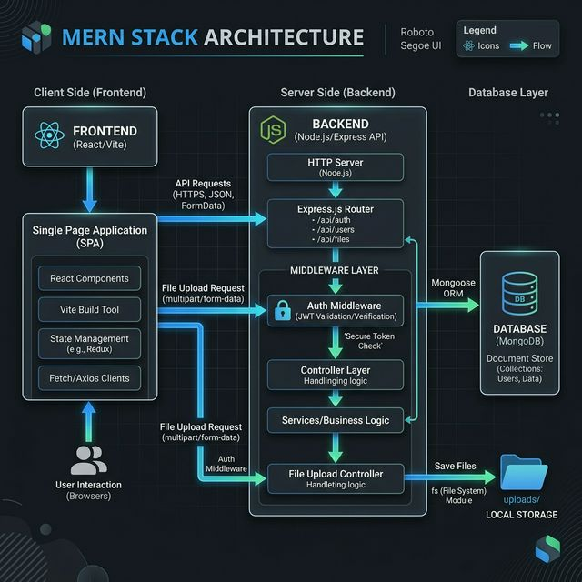

# JobPortal: Comprehensive Full-Stack MERN Technical Report

## 1. Executive Summary
**JobPortal** is a high-performance recruitment ecosystem built to bridge the gap between talent and opportunity. Leveraging the modern MERN stack, the platform provides a secure, scalable, and responsive environment for job postings, candidate applications, and professional profile management. The system is designed with a role-centric philosophy, ensuring that both Job Seekers and Employers have access to specialized tools tailored to their unique workflows.

---

## 2. Technical Architecture & Design Rationale

### 2.1 System Architecture Diagram



> [!NOTE]  
> The diagram above illustrates the decoupled MERN stack architecture, showing the interaction between the React frontend, the Express.js middleware/backend layers, and the MongoDB persistence layer.

### 2.2 Technology Stack
| Layer | Technology | Version | Rationale |
| :--- | :--- | :--- | :--- |
| **Frontend** | React | 19.2.4 | Industry-standard for building dynamic user interfaces with component reusability. |
| **Build Tool** | Vite | 8.0.1 | Faster development server and optimized production builds compared to CRA. |
| **Styling** | Tailwind CSS | 3.4.19 | Utility-first approach for rapid, consistent, and responsive UI development. |
| **Backend** | Express.js | 5.2.1 | Minimalist and flexible Node.js web application framework for robust APIs. |
| **Database** | MongoDB | (MERN) | NoSQL database ideal for handling heterogeneous profile data and scalable job listings. |
| **ORM** | Mongoose | 9.3.3 | Provides schema-based validation and a crisp API for MongoDB interaction. |
| **Security** | JWT / Bcryptjs | 9.0.3 / 3.0.3 | Secure session management via tokens and industry-standard password hashing. |

---

## 3. Core Functional Modules

### 3.1 User Role Workflows
The system intelligently branches functionality based on the authenticated user's role.

#### Job Seeker Journey
1. **Discovery**: Search for jobs using real-time filters (Title, Company, Location).
2. **Profile Optimization**: Update professional bio and set skills.
3. **resume Management**: Upload PDF/DOC resumes using the integrated Multer-powered upload system.
4. **Application**: Apply to jobs with targeted cover letters.
5. **Tracking**: Monitor application status (Pending -> Accepted/Rejected) in the Seeker Dashboard.

#### Employer Journey
1. **Recruitment**: Create and publish comprehensive job listings.
2. **Management**: Edit listing details or remove expired postings.
3. **Pipeline Review**: Access a detailed view of all applicants for each job.
4. **决策**: Direct communication via status updates ('Accept' or 'Reject') that reflect instantly on the seeker's dashboard.

---

## 4. Database Schema & Data Integrity

### 4.1 Relationship Model
- **User ↔ Job**: One-to-Many (One Employer can post multiple jobs).
- **Job ↔ Application**: One-to-Many (One Job can receive multiple applications).
- **User ↔ Application**: One-to-Many (One Seeker can apply to multiple jobs).

### 4.2 Detailed Entity Definitions
- **User Schema**: Implements pre-save hooks for password hashing and role validation (`enum: ['seeker', 'employer']`).
- **Job Schema**: Features full-text searchable fields and indexed references to the posting employer.
- **Application Schema**: Tracks the lifecycle of a recruitment attempt, linking the seeker, the specific job, and the uploaded resume file path.

---

## 5. API Reference & Sample Payloads

### 5.1 Authentication Endpoints
`POST /api/auth/register`
- **Description**: Registers a new user.
- **Sample Request**:
```json
{
  "name": "Jane Doe",
  "email": "jane@example.com",
  "password": "securePassword123",
  "role": "seeker"
}
```

### 5.2 Job Management Endpoints
`POST /api/jobs` (Employer Only)
- **Description**: Publishes a new job.
- **Sample Response**:
```json
{
  "_id": "60d5ec...",
  "title": "Senior Frontend Developer",
  "company": "TechCorp",
  "location": "Remote",
  "salary": "$120k - $150k",
  "requirements": ["React", "Tailwind", "Vite"],
  "postedBy": "60d5eb...",
  "createdAt": "2024-03-30T..."
}
```

### 5.3 Application Endpoints
`POST /api/applications/apply/:jobId` (Seeker Only)
- **Description**: Submits a job application.
- **Sample Request**:
```json
{
  "resumeLink": "/uploads/1711785...-resume.pdf",
  "coverLetter": "I am excited to apply for this role..."
}
```

---

## 6. Project Directory Structure

```text
job-portal/
├── api/
│   ├── index.js             # Server entry point & DB connection
│   ├── middleware/          # Security & file-upload logic
│   │   └── auth.js          # JWT verification & User injection
│   ├── models/              # Mongoose data definitions
│   │   ├── User.js          # Auth & Profile schema
│   │   ├── Job.js           # Recruitment post schema
│   │   └── Application.js   # Application lifecycle schema
│   ├── routes/              # Modular API routing
│   └── uploads/             # Physical storage for user-uploaded resumes
├── client/
│   ├── src/
│   │   ├── components/      # Common UI elements (Navbar, Buttons)
│   │   ├── pages/           # View-level logic (Login, Dashboard, PostJob)
│   │   ├── App.jsx          # Route definitions & Toastify setup
│   │   └── main.jsx         # React mounting & CSS injection
│   ├── public/              # Static assets
│   └── tailwind.config.js   # Custom design tokens
└── Project_Report.md        # This document
```

---

## 7. Operational Guide

### Local Development Setup
1. **Clone & Install**:
   ```bash
   git clone <repository_url>
   cd job-portal/api && npm install
   cd ../client && npm install
   ```
2. **Environment Configuration**:
   - Create `api/.env`: `MONGO_URI`, `JWT_SECRET`, `PORT`.
   - Create `client/.env`: `VITE_API_URL`.
3. **Launch**:
   - Backend: `node index.js` (typically port 5000).
   - Frontend: `npm run dev` (typically port 5173).
